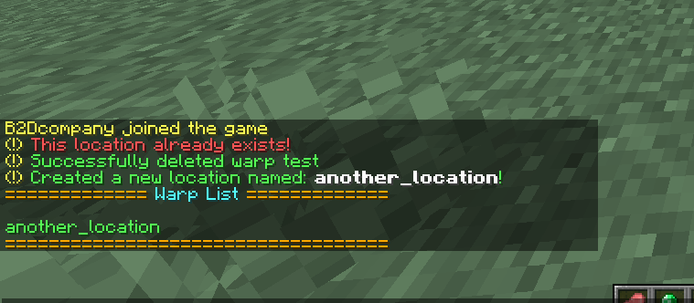

# Express TP - Pay-to-TP

Looking for an alternative to nether portal highways in your SMP? Express-TP is a teleportation plugin that prompts you to pay a corresponding amount for teleporting to a certain player.

**Express-TP is:**
- **Customizable** (customize the default payment, payment material)
- **Dynamic** (customize the payment dynamically by adding a multiplier for how distant 2 locations are)
- **SUPER user-friendly** Colored text, argument feedback, responsive!
----------

Some Demo
------------

**Too good to be a free plugin?** 
How good is this plugin?! These images of in-game usage will do the explaining for you!  

  

Commands
---------------
**/etp (player to teleport to)**
  - The command executor will be prompted to pay the respective amount of diamonds
  - Permission needed: **etp.use**  

**/ltp (second arg : action or location)**
  - Second args: (list, create, remove)
  - Permission needed: **ltp.use**

Supported Versions
---------------
1.17.1

---------------

Contributing
---------------
Looking to contribute to the plugin? Just create a pull request

Problems
---------------
The plugin is not perfect. If there are any problems while using plugin, you can report them [here](https://github.com/TheB2D/Express-TP/issues/new)
